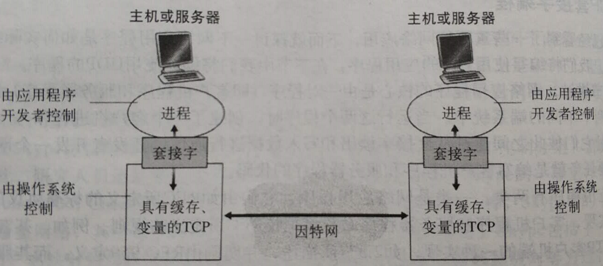
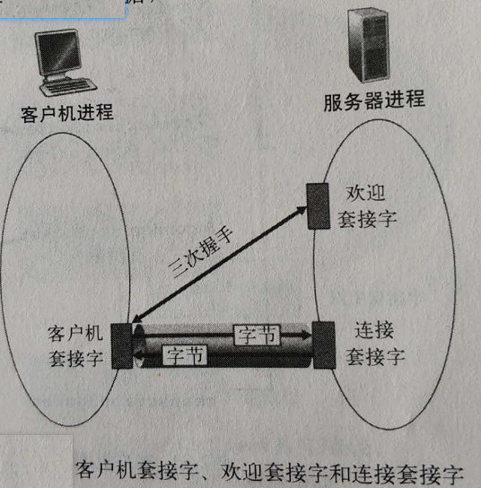
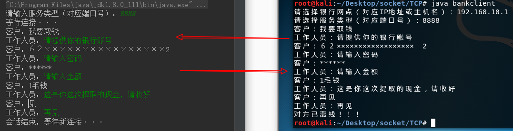
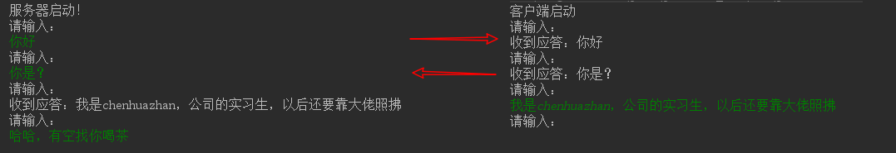

## 1  引入

套接字编程是属于应用层的技术。网络应用程序的核心是由一对程序（即客户机程序和服务器程序）组成的，它们位于两个不同的端系统中。当它们运行时，会创建一个客户端进程和服务端进程，同时它们之间通过套接字读出和写入数据，约定 IP 地址（或主机名）和端口号进行通信。


## 2  网络应用程序的分类

分两类：网络应用程序分类和专用网络应用程序

+ 网络应用程序：
    + 遵循RFC定义的规则
    + 使用与协议相关的端口号，如HTTP协议对应80端口
    + 例子：FTP客户端程序、FTP服务端程序

+ 专用网络应用程序：
    + 不必遵循RFC标准
    + 不要使用RFC中已定义的端口号，避免冲突
    + 在没得到源码的情况下不能开发出与之交互的程序

在研发阶段，开发者还要决定该应用程序运行在TCP还是UDP之上


## 3  TCP套接字编程

### TCP套接字编程理论

​	运行在在不同机器、上的进程通过向套接字发送报文来进行通信，每一个进程好比是一座房子，进程的套接字就好比是一个门。如下图所示，应用程序开发者在套接字的应用层一侧可以控制所有东西，但是，它不能控制运输层一侧，充其量，只能设置一下TCP参数，如最大缓冲长度和最大报文段长度。




客户机负责发起与服务器的联系，服务器为了能对客户机发起的连接做出响应，必须先做好以下准备：

+ 服务器程序在客户机发起联系之前必须处于运行状态；
+ 服务器必须开放某种类型的套接字服务；
+ 服务器必须指定服务对应的端口号。


​	客户端通过创建一个套接字来向服务器发起一个TCP连接，套接字要指定服务器的地址（包括服务器IP和服务进程端口号）。

​	在三次握手和信息传输过程中，客户端创建了一个套接字，二服务端创建了两个套接字，如下图所示：




### 客户机/服务器应用程序例子

#### 功能描述：

```
1 客户机从其标准输入读取一行字符
2 服务器从其连接套接字读取一行字符
3 服务器将该行字符改为大写
4 服务器返回修改后的字符
5 客户机接收修改后的字符并在其标准输出中打印出来
```


#### java代码

client.java

```java
package TCP;
import java.io.*;
import java.net.*;
import java.util.Scanner;

public class client {

    public static void main(String argv[]) throws Exception{
        String sentence;
        String modifiedSentence;
        BufferedReader inFromUser = new BufferedReader(new InputStreamReader(System.in));
        Scanner cin = new Scanner(System.in);

        System.out.print("请输入服务器IP地址或主机名：");
        String address = cin.next();

        System.out.print("请输入服务器服务进程端口号：");
        int port = cin.nextInt();
        Socket clientSocket = new Socket(address, port);
        System.out.print("请输入要发送的内容：");
        DataOutputStream outToServer = new DataOutputStream(clientSocket.getOutputStream());
        BufferedReader inFromServer = new BufferedReader(new InputStreamReader(clientSocket.getInputStream()));

        sentence = inFromUser.readLine();
        outToServer.writeBytes(sentence + '\n');
        modifiedSentence = inFromServer.readLine();

        System.out.println("服务器返回的结果是:" + modifiedSentence);
        clientSocket.close();
        cin.close();
    }
}

```


server.java

```java
package TCP;

import java.io.*;
import java.net.*;
import java.util.Scanner;

public class server {

    public static void main(String argv[]) throws Exception{
        String clientSentence;
        String capitalizedSentence;
        Scanner cin = new Scanner(System.in);

        System.out.print("请输入进程端口号：");
        int port = cin.nextInt();
        ServerSocket welcomeSocket = new ServerSocket(port);
        
        System.out.println("等待连接···");
        while(true){
            Socket connectionSocket = welcomeSocket.accept();
            System.out.println("接收到一个TCP请求\n客户机地址是：" + connectionSocket.getInetAddress().getHostAddress());
            System.out.println("客户机端口号是：" + connectionSocket.getPort());
            BufferedReader inFromClient = new BufferedReader(new InputStreamReader(connectionSocket.getInputStream()));

            DataOutputStream outToClient = new DataOutputStream(connectionSocket.getOutputStream());

            clientSentence = inFromClient.readLine();
            System.out.println("接收到的字符串为：" + clientSentence);
            capitalizedSentence = clientSentence.toUpperCase() + '\n';
            outToClient.writeBytes(capitalizedSentence);
            System.out.println("会话结束，等待新连接···");
        }
    }
}

```


#### VC6.0代码

client.c

```c
#include <WINSOCK2.H>
#include <STDIO.H>
#pragma  comment(lib,"ws2_32.lib")
 
 
int main(int argc, char* argv[])
{
	WORD sockVersion = MAKEWORD(2,2);
	WSADATA data; 
    if(WSAStartup(sockVersion, &data) != 0)
    {
		return 0;
    }

	SOCKET sclient = socket(AF_INET, SOCK_STREAM, IPPROTO_TCP);
    if(sclient == INVALID_SOCKET)
	{
        printf("invalid socket !");
        return 0;
    }

    sockaddr_in serAddr;
    serAddr.sin_family = AF_INET;
    serAddr.sin_port = htons(8888);
    serAddr.sin_addr.S_un.S_addr = inet_addr("127.0.0.1"); 
    if (connect(sclient, (sockaddr *)&serAddr, sizeof(serAddr)) == SOCKET_ERROR)
    {
        printf("connect error !");
        closesocket(sclient);
        return 0;
    }
    char sendData[100];
	printf("请输入要发送的字符串：");gets(sendData);
    send(sclient, sendData, strlen(sendData), 0);

    char recData[255];
    int ret = recv(sclient, recData, 255, 0);
    if(ret > 0)
    {
        recData[ret] = 0x00;
       printf(recData);
	   printf("\n");
    }
    closesocket(sclient);
    WSACleanup();
    return 0;
}

```


server.c

```c
#include <stdio.h>
#include <winsock2.h>
#include <string.h>
#pragma comment(lib,"ws2_32.lib")

int main(int argc, char* argv[])
{
	//初始化WSA
	WORD sockVersion = MAKEWORD(2,2); 
	//WORD类型是一个16位的无符号整型，在WTYPES.H中被定义为：typedef unsigned short WORD
	//使用MAKEWORD宏可以给一个WORD类型赋值。例如要表示主版本号2，副版本号0
	WSADATA wsaData;//WSADATA类型是一个结构，描述了Socket库的一些相关信息
	if(WSAStartup(sockVersion, &wsaData)!=0)
	//WSAStartup函数被用来初始化Socket环境,它的定义如下：int PASCAL FAR WSAStartup(WORD wVersionRequired, LPWSADATA lpWSAData);
    //其返回值为整型，调用方式为PASCAL（即标准类型，PASCAL等于__stdcall），参数有两个，第一个参数为WORD类型，指明了Socket的版本号，第二个参数为WSADATA类型的指针。
    //若返回值为0，则初始化成功，若不为0则失败。
	{
		return 0;
	}

    //创建套接字
    SOCKET slisten = socket(AF_INET, SOCK_STREAM, IPPROTO_TCP);
	/*socket函数,socket的创建函数，其定义为：
    SOCKET PASCAL FAR socket (int af, int type, int protocol);
    第一个参数为int af，代表网络地址族，目前只有一种取值是有效的，即AF_INET，代表internet地址族；
    第二个参数为int type，代表网络协议类型，SOCK_DGRAM代表UDP协议，SOCK_STREAM代表TCP协议；
    第三个参数为int protocol，指定网络地址族的特殊协议，目前无用，赋值0即可。
    返回值为SOCKET，若返回INVALID_SOCKET则失败。*/
    if(slisten == INVALID_SOCKET)
    {
        printf("socket error !");
        return 0;
    }

    //绑定IP和端口
    sockaddr_in sin;
	/*sockaddr_in定义了socket发送和接收数据包的地址，定义：
      struct sockaddr_in {
      short sin_family;          
	  u_short sin_port;          
      struct in_addr sin_addr;   
      char sin_zero[8];          
      };*/
    sin.sin_family = AF_INET;        //AF_INET，代表internet地址族
    sin.sin_port = htons(8888);
    sin.sin_addr.S_un.S_addr = INADDR_ANY; 
    if(bind(slisten, (LPSOCKADDR)&sin, sizeof(sin)) == SOCKET_ERROR)
    {
        printf("bind error !");//绑定失败
    }

    //开始监听
    if(listen(slisten, 5) == SOCKET_ERROR)
    {
        printf("listen error !");//监听失败
        return 0;
    }
     //循环接收数据
    SOCKET sClient;
    sockaddr_in remoteAddr;  //定义远程地址
    int nAddrlen = sizeof(remoteAddr);
    char revData[255]; 
    while (true)
    {
        printf("等待连接...\n");
        sClient = accept(slisten, (SOCKADDR *)&remoteAddr, &nAddrlen);
        if(sClient == INVALID_SOCKET)
        {
            printf("accept error !");
            continue;
        }
        printf("接受到一个连接：%s \r\n", inet_ntoa(remoteAddr.sin_addr));//inet_ntoa( )函数,IP地址转换函数,能把网络字节序IP转化点分十进制IP
        
        //接收数据
        int ret = recv(sClient,revData , 255, 0);        
        if(ret > 0)
        {
            revData[ret] = 0x00;
            printf(revData);
	        printf("\n");
        }

        //发送数据
        char sendData[100];
		strcpy(sendData,revData);
		char *p=sendData;
		while(*p!='\0')
		{
			if(*p>='a'&&*p<='z')
				*p=*p-'a'+'A';
			p++;
		}
        send(sClient, sendData, strlen(sendData), 0);
        closesocket(sClient);
    }
    
    closesocket(slisten);
    WSACleanup();
    return 0;
}
```

### TCP套接字编程总结

​	两个进程通过TCP进行通信时，进程之间存在一条管道，直到通信其中一方关闭它为止。当两个进程之一想向另一个进程发送字节时，它直接将这些字节插入管道即可，且不必再次指定服务器地址和端口号，接收方接收到的消息顺序与发送方发送消息顺序一致。下面展示两个案例做进一步说明。

#### 模拟银行取款对话场景

一问一答，一对一服务



银行工作人员

```java
package TCP;

import java.io.*;
import java.net.*;
import java.util.Scanner;

public class teacher {

    public static void main(String argv[]) throws Exception{
        Scanner cin = new Scanner(System.in);

        System.out.print("请输入服务类型（对应端口号）：");
        int port = cin.nextInt();
        ServerSocket welcomeSocket = new ServerSocket(port);

        System.out.println("等待连接···");
        while(true){
            Socket connectionSocket = welcomeSocket.accept();
            OutputStream os = connectionSocket.getOutputStream();
            InputStream is = connectionSocket.getInputStream();

            while (true){
                if(connectionSocket.isConnected()){
                    byte[] bt = new byte[1024];
                    int length = is.read(bt);
                    String respondData = new String(bt, 0, length);
                    System.out.println("客户：" + respondData);
                    if(respondData.equals("再见")){
                        connectionSocket.close();
                        System.out.println("对方已离线！！！");
                        break;
                    }
                }

                if(connectionSocket.isConnected()){
                    System.out.print("工作人员：");
                    String sendData = cin.next();
                    os.write(sendData.getBytes());
                    os.flush();
                    if(sendData.equals("再见")){
                        connectionSocket.close();
                        break;
                    }
                }

            }
            System.out.println("会话结束，等待新连接···");
        }
    }
}

```


银行客户

```java
package TCP;

import java.io.*;
import java.net.*;
import java.util.Scanner;

public class student {

    public static void main(String argv[]) throws Exception {

        Scanner cin = new Scanner(System.in);

        System.out.print("请选择银行网点（对应IP地址或主机名）：");
        String address = cin.next();

        System.out.print("请选择服务类型（对应端口号）：");
        int port = cin.nextInt();
        String sendData, respondData;
        Socket clientSocket = new Socket(address, port);
        OutputStream os = clientSocket.getOutputStream();
        InputStream is = clientSocket.getInputStream();
        while (true) {
            //客户端发送信息
            System.out.print("客户：");
            sendData = cin.next();
            os.write(sendData.getBytes());
            os.flush();
            if(sendData.equals("再见")){
                clientSocket.close();
                break;
            }
            //客户端接收信息
            if(clientSocket.isConnected()){
                byte[] by = new byte[1024];
                int index = is.read(by);
                respondData = new String(by, 0, index);
                System.out.println("工作人员：" + respondData);
                if(respondData.equals("再见")){
                    clientSocket.close();
                    System.out.println("对方已离线！！！");
                    break;
                }
            }

        }
        cin.close();
    }
}

```


#### 两人聊天场景

一对一，不强制一问一答，涉及多线程



A

```java
package TCP;

import java.io.*;
import java.net.ServerSocket;
import java.net.Socket;
import java.util.Scanner;

public class A {
    public static void main(String[] args) throws IOException {
        ServerSocket ss = new ServerSocket(8000);
        System.out.println("服务器启动！");
        final Socket s = ss.accept();
        boolean b = true;
        InputStream is = s.getInputStream();
        //服务器把输入放入线程里面执行，不会影响主线程的接收信息功能
        Thread t = new Thread(){
            OutputStream os = s.getOutputStream();
            Scanner sc  = new Scanner(System.in);
            @Override
            public void run() {
                // TODO Auto-generated method stub
                boolean b = true;
                while(b){
                    try {
                        System.out.println("请输入：");
                        os.write(sc.next().getBytes());
                        os.flush();
                    } catch (IOException e) {
                        // TODO Auto-generated catch block
                        e.printStackTrace();
                    }
                }
            }
        };
        t.start();
        while(b){
            byte[] bt = new byte[1024];
            int length = is.read(bt);
            String str = new String(bt,0,length);
            System.out.println("收到应答：" + str);
            System.out.println("请输入：");
        }

        is.close();
        s.shutdownInput();
        s.close();
        ss.close();

    }
}

```


B

```java
package TCP;

import java.io.IOException;
import java.io.InputStream;
import java.io.OutputStream;
import java.net.Socket;
import java.net.UnknownHostException;
import java.util.Scanner;

public class B {
    public static void main(String[] args) throws UnknownHostException, IOException {
        final Socket client = new Socket("127.0.0.1",8000);
        Scanner sc = new Scanner(System.in);
        System.out.println("客户端启动");
        OutputStream os = client.getOutputStream();
        //新建一个线程用来接收信息，不影响主线程的输入发送信息。
        Thread t = new Thread(){
            InputStream is = client.getInputStream();
            @Override
            public void run() {
                // TODO Auto-generated method stub
                boolean b = true;
                while(b){
                    try {
                        byte[] bt = new byte[1024];
                        int length = is.read(bt);
                        String str = new String(bt,0,length);
                        System.out.println("收到应答：" + str);
                        System.out.println("请输入：");
                    } catch (IOException e) {
                        // TODO Auto-generated catch block
                        e.printStackTrace();
                    }
                }
            }
        };
        t.start();
        boolean b = true;
        while(b){
            System.out.println("请输入：");
            os.write(sc.next().getBytes());
            os.flush();
        }
        os.close();
        client.shutdownOutput();
        client.close();
    }
}
```


## 4  UDP套接字编程

### UDP套接字编程理论

所谓UDP，就是发送出去就不管的一种网络协议。

UDP也允许运行在两个或多个进程彼此通信，然而它与TCP有多种不同特点

+ UDP是一种无连接的协议，因此不需要管道，也不需要建立通信管道前的握手阶段，客户端发送请求时如果服务器没有运行也不会报错。UDP编程的发送端只管发送就可以了，不用检查网络连接状态。
+ UDP面向报文传输，每一个报文都必须携带目标地址和端口号
+ 不可靠传输，尽力而为

### 客户机/服务器应用程序例子

还是拿TCP那个案例来做对比实现这个功能：

#### java代码

client.java

```java
package UDP;

import java.io.*;
import java.net.*;

public class client {
    public static void main(String args[]) throws Exception{
        BufferedReader inFromUser = new BufferedReader(new InputStreamReader(System.in));
        DatagramSocket clientSocket = new DatagramSocket();
        InetAddress IPAddress = InetAddress.getByName("127.0.0.01");

        byte[] sendData;
        byte[] receiveData = new byte[1024];

        String sentence = inFromUser.readLine();
        sendData = sentence.getBytes();

        DatagramPacket sendPacket = new DatagramPacket(sendData, sendData.length, IPAddress, 9876);
        clientSocket.send(sendPacket);

        DatagramPacket receivePacket = new DatagramPacket(receiveData, receiveData.length);
        clientSocket.receive(receivePacket);

        String modifiedSentence = new String(receivePacket.getData());

        System.out.println("FROM SERVER:" + modifiedSentence);
        clientSocket.close();
    }
}
```

server.java

```java
package UDP;

import java.net.*;

public class server {

    public static void main(String args[]) throws Exception{
        DatagramSocket serverSocket = new DatagramSocket(9876);

        byte[] receiveData = new byte[1024];
        byte[] sendData;

        while (true){
            DatagramPacket receivePacket = new DatagramPacket(receiveData, receiveData.length);
            serverSocket.receive(receivePacket);
            String sentence = new String(receivePacket.getData());
            InetAddress IPAddress = receivePacket.getAddress();

            int port = receivePacket.getPort();
            String capitalizedSentence = sentence.toUpperCase();

            sendData = capitalizedSentence.getBytes();
            DatagramPacket sendPacket = new DatagramPacket(sendData, sendData.length, IPAddress, port);
            serverSocket.send(sendPacket);
        }
    }
}

```


#### VC6.0代码

client.c

```c
#include <stdio.h>
#include <winsock2.h>
 
#pragma comment(lib, "ws2_32.lib") 
  
int main(int argc, char* argv[])
{
	WORD socketVersion = MAKEWORD(2,2);
    WSADATA wsaData; 
    if(WSAStartup(socketVersion, &wsaData) != 0)
    {
        return 0;
    }
    SOCKET sclient = socket(AF_INET, SOCK_DGRAM, IPPROTO_UDP);
    
    sockaddr_in sin;
    sin.sin_family = AF_INET;
    sin.sin_port = htons(8888);
    sin.sin_addr.S_un.S_addr = inet_addr("127.0.0.1");
    int len = sizeof(sin);
    
    char sendData[100];
	gets(sendData);
    sendto(sclient, sendData, strlen(sendData), 0, (sockaddr *)&sin, len);

    char recvData[255];     
    int ret = recvfrom(sclient, recvData, 255, 0, (sockaddr *)&sin, &len);
    if(ret > 0)
    {
        recvData[ret] = 0x00;
        printf(recvData);
		printf("\n");
    }

    closesocket(sclient);
    WSACleanup();
    return 0;
}
```

server.c

```c
#include <stdio.h>
#include <winsock2.h>
  
#pragma comment(lib, "ws2_32.lib") 
 
int main(int argc, char* argv[])
{
	WSADATA wsaData;
    WORD sockVersion = MAKEWORD(2,2);
    if(WSAStartup(sockVersion, &wsaData) != 0)
    {
        return 0;
    }

    SOCKET serSocket = socket(AF_INET, SOCK_DGRAM, IPPROTO_UDP); 
    if(serSocket == INVALID_SOCKET)
    {
        printf("socket error !");
        return 0;
	}

    sockaddr_in serAddr;
    serAddr.sin_family = AF_INET;
    serAddr.sin_port = htons(8888);
    serAddr.sin_addr.S_un.S_addr = INADDR_ANY;
    if(bind(serSocket, (sockaddr *)&serAddr, sizeof(serAddr)) == SOCKET_ERROR)
	{
        printf("bind error !");
       closesocket(serSocket);
        return 0;
    }
    
    sockaddr_in remoteAddr;
    int nAddrLen = sizeof(remoteAddr); 
    while (true)
    {
        char recvData[255];  
        int ret = recvfrom(serSocket, recvData, 255, 0, (sockaddr *)&remoteAddr, &nAddrLen);
        if (ret > 0)
        {
            recvData[ret] = 0x00;
            printf("接受到一个连接：%s \r\n", inet_ntoa(remoteAddr.sin_addr));
           printf(recvData); 
			printf("\n");
        }

        char sendData[100];
		char *p=recvData,*q=sendData;
		while(*p!='\0')
		{
			if(*p>='a'&&*p<='z')
		        *q=*p-'a'+'A';
			else
				*q=*p;
			p++;q++;
		 }
		 *q='\0';
        sendto(serSocket, sendData, strlen(sendData), 0, (sockaddr *)&remoteAddr, nAddrLen);    
	}
    closesocket(serSocket); 
    WSACleanup();
    return 0;
}
```


